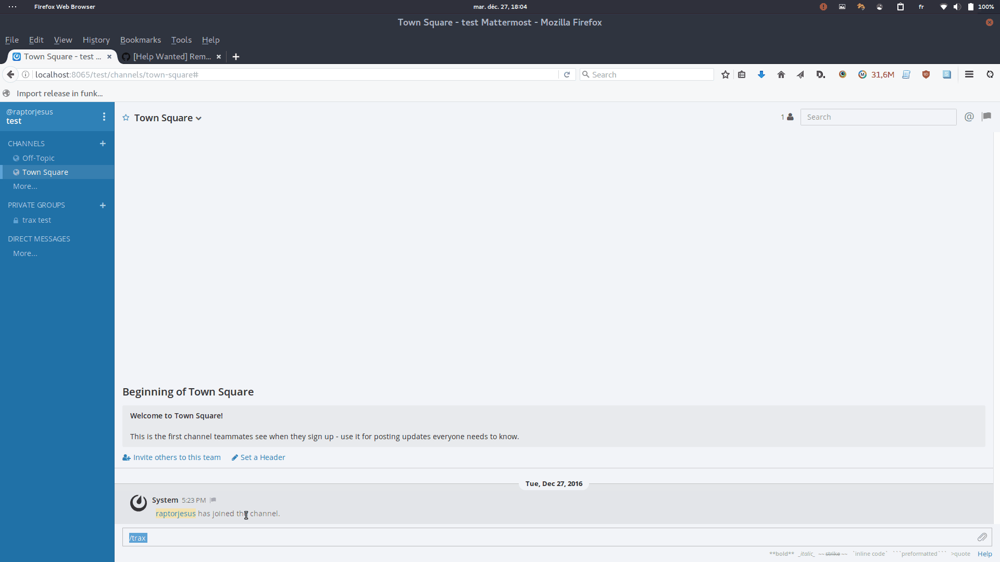

trax
====

Simple time tracking server designed to work with Mattermost / Slack

.. image:: https://img.shields.io/badge/built%20with-Cookiecutter%20Django-ff69b4.svg
     :target: https://github.com/pydanny/cookiecutter-django/
     :alt: Built with Cookiecutter Django

:License: MIT

Deployment
----------

Deployment is supported using Docker and docker-compose exclusively::

    git clone https://github.com/EliotBerriot/trax.git
    cd trax

    cp env.example .env
    # edit the .env file, especially the SLASH_COMMAND_TOKEN variable

    docker-compose build
    docker-compose up -d

    # create tables in the database
    docker-compose run django python manage.py migrate

You can use the docker-compose.override.yml file to tweak the containers behaviour.
